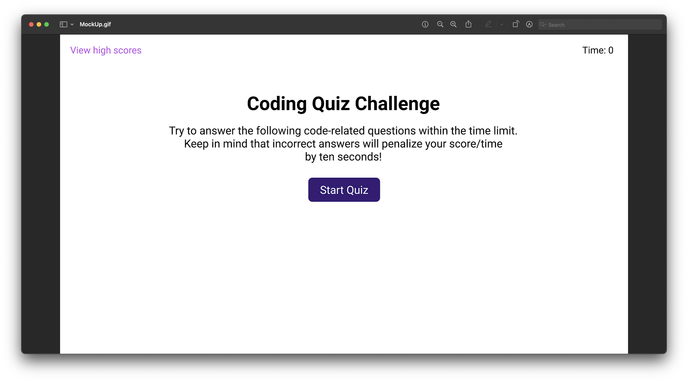

# Script-Racer

## Description

The "Script-Racer" project is a quiz game built using JavaScript, focusing on the manipulation of the DOM (Document Object Model). The motivation behind this project is to learn via hands-on practice for learners or enthusiasts to better understand JavaScript and DOM manipulation. 

### Objectives:

- To help users gauge their JavaScript knowledge by presenting a series of questions.
- To improve and understand DOM manipulation techniques.
- To provide an interactive way to learn JavaScript.

### What problem does it solve?

It serves as a practice tool for JavaScript learners, enabling them to assess their knowledge and skills.

### What did you learn?

I gained a more profound understanding of DOM manipulation, event handling, and data storage in JavaScript.

## Table of Contents

- [Installation](#installation)
- [Usage](#usage)
- [Credits](#credits)
- [License](#license)

## Installation

To get this project up and running on your local machine:

1. Clone the GitHub repository.
2. Open the HTML file in your preferred browser.
3. To experience the full functionality of the Script Racer, it is recommended to use the [Chrome](https://www.google.com/chrome/) browser. No additional installation is required.

## Usage

The game starts with a timer and a series of JavaScript-related questions. Users need to answer them before the timer runs out. The final score is displayed at the end, and the user has the option to save their score.

## Credits

- [OpenJavaScript](https://www.youtube.com/watch?v=-ZRDZyUjEEI&ab_channel=OpenJavaScript)
- [ReachStar](https://www.youtube.com/watch?v=4piMZDO5IOI&ab_channel=ReachStar)
- [W3Schools](https://www.w3schools.com/jsref/event_onclick.asp)
- [BroCode](https://www.youtube.com/watch?v=8Nsb9cjmOVA&ab_channel=BroCode)
- [MDN Web Docs](https://developer.mozilla.org/en-US/)

Additional credit to Faran my tutor to help impliment the finishing touches and my class insturctor Hubert!

## License

This project is open-source and available under the MIT License. For more details, please refer to the [LICENSE.md](LICENSE.md) file in the repository.

## Badges

